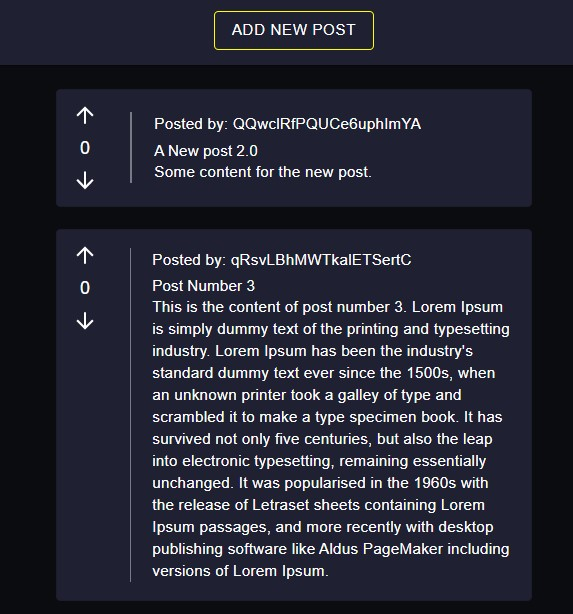

# "Reddit" clone to display posts with upvotes and downvotes.

Created using React JS, Material-UI and Firebase.

## Installation

1. Clone the repostory

    ### `git clone `

2. In the project directory run:
    ### `npm install`

3. Run the app in  [http://localhost:3000].
    ### `npm start`

## Project Preview

## License: MIT

